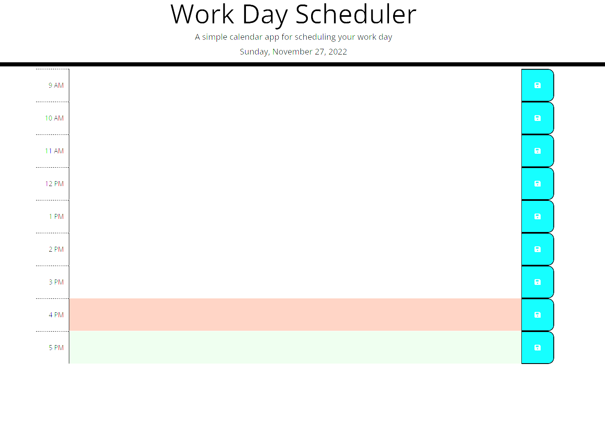

# Online Simple Scheduler

## Description

This project is a Simple Online Event Scheduler using jQuery and Luxon to provide functionality. I built this to experiment with jQUery, Luxon, and further my knowledge on dynamic webpage generation.

With Moment.js considered a legacy library, I used this opportunity to explore the Luxon.js library for processing DateTime objects. Luxon was simple to use and the documentation was easy to follow. Using an immutable DateTime objects was incredibly useful at it allowed me to use the same object repeatedly without changing its instance. I could rely on the same unchanging object wherever I needed it in the script.

**User Story:**
```
AS AN employee with a busy schedule
I WANT to add important events to a daily planner
SO THAT I can manage my time effectively
```

**Acceptance Criteria:**
```
GIVEN I am using a daily planner to create a schedule
WHEN I open the planner
THEN the current day is displayed at the top of the calendar
WHEN I scroll down
THEN I am presented with time blocks for standard business hours
WHEN I view the time blocks for that day
THEN each time block is color-coded to indicate whether it is in the past, present, or future
WHEN I click into a time block
THEN I can enter an event
WHEN I click the save button for that time block
THEN the text for that event is saved in local storage
WHEN I refresh the page
THEN the saved events persist
```

## Table of Contents

1. [Installation](#installation)
2. [Usage](#usage)
3. [License](#license)
4. [Contribute](#contribute)
5. [Tests](#tests)
6. [Questions](#questions)


## Installation

No installation instructions. Just visit [Online Simple Scheduler](https://pbp66.github.io/simple-scheduler/) to access the scheduler.

## Usage

When first visiting the site, the website will load this page:



To use the scheduler, enter the details of an event, appointment, task, etc at the time it occurs. Click the save button in the right hand column to save the event. Upon saving, a notification will appear above the schedule notifying you that the event was successfully saved to local storage along with stating the time and event details. 


The event will be saved until it is updated or the browser's local storage is cleared.

## License


MIT

Copyright (c) 2022 James Perry

Permission is hereby granted, free of charge, to any person obtaining a copy of this software and associated documentation files (the "Software"), to deal in the Software without restriction, including without limitation the rights to use, copy, modify, merge, publish, distribute, sublicense, and/or sell copies of the Software, and to permit persons to whom the Software is furnished to do so, subject to the following conditions:

The above copyright notice and this permission notice shall be included in all copies or substantial portions of the Software.

THE SOFTWARE IS PROVIDED "AS IS", WITHOUT WARRANTY OF ANY KIND, EXPRESS OR IMPLIED, INCLUDING BUT NOT LIMITED TO THE WARRANTIES OF MERCHANTABILITY, FITNESS FOR A PARTICULAR PURPOSE AND NONINFRINGEMENT. IN NO EVENT SHALL THE AUTHORS OR COPYRIGHT HOLDERS BE LIABLE FOR ANY CLAIM, DAMAGES OR OTHER LIABILITY, WHETHER IN AN ACTION OF CONTRACT, TORT OR OTHERWISE, ARISING FROM, OUT OF OR IN CONNECTION WITH THE SOFTWARE OR THE USE OR OTHER DEALINGS IN THE SOFTWARE.

## How to Contribute

Before contributing, be sure to read the GitHub [Code of Conduct](https://github.com/github/docs/blob/main/CODE_OF_CONDUCT.md). If you have an issue, search all open issues to see if one matches the description of your issue. If not, proceed to create one providing details on the issue, errors, OS, options provided, installed node packages, etc. Issues are not assigned to anyone by the repository team. To select an issue to work on, open a pull request and generate a new branch labeled as the issue. Add your name as a contributor to the issue in question. When you make the desired changes and fixes, push all changes to your branch on the repository and submit. The repository team will review the changes. If acceptable, we will merge the changes to main and we will notify you of a successful merge or any necessary changes before a merge can take place.

## Tests

No Tests Provided.

## Questions

Repo owner: [pbp66](https://github.com/pbp66).
For any questions, you may contact pbp66 via email: perryjames00@gmail.com. Please format your email using the following template:

- Subject: Repository - Question/Issue
- Body: Summarize the issue with a brief description for the first paragraph. Additional paragraphs can be used for a long description, if needed. Include any errors when using this project
- Signature: Please leave an email address so that any updates sent get back to you.